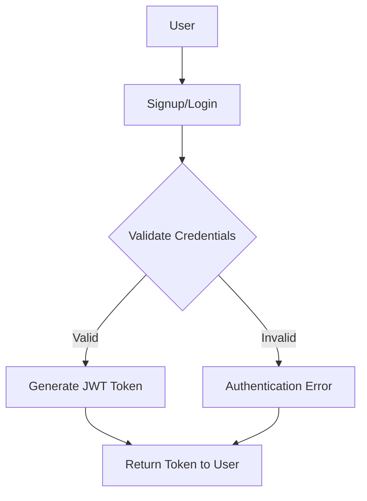
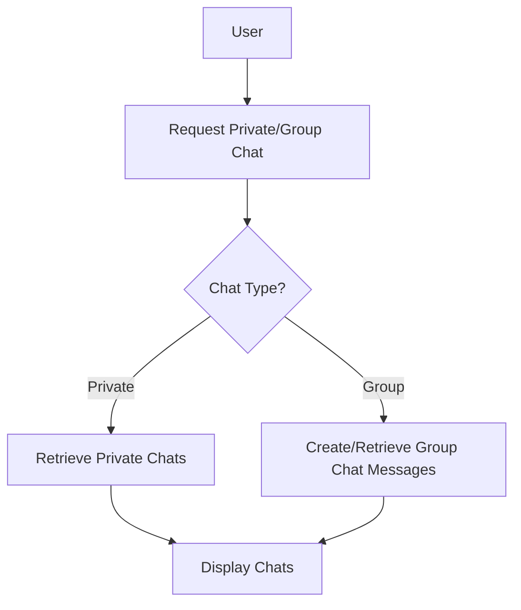

### Pre-Service Implementation Documentation

#### Introduction

This document outlines the technical details and implementation process for developing a chat service. The service
includes features such as user authentication, management of private and group chats, media file uploads, and real-time
messaging. The document explains how each of these features is implemented, the libraries used, and the code structure
involved.

---

### 1. User Authentication

**Libraries Used:**

- **FastAPI**: For building the web service.
- **OAuth2**: For handling authentication and issuing access tokens.
- **PyJWT**: For generating and validating JWT tokens.

#### Implementation Details

User authentication is implemented using OAuth2 and JWT. A JWT token is generated for users who successfully log in.

1. **Signup:**
    - A signup request is received, and user details are stored in the database.
    - The user's password is hashed using the bcrypt algorithm before storage.

2. **Login:**
    - The user logs in with an email and password.
    - The email and password are validated against the database.
    - Upon successful validation, a JWT token is generated and returned to the user.

3. **JWT Token Generation:**
    - The JWT token includes user information (e.g., email) and an expiration time.
    - The token is signed with the server's private key and returned to the user.

**Authentication Flowchart:**

---

### 2. Management of Private and Group Chats

**Libraries Used:**

- **Motor**: For asynchronous access to the MongoDB database.

#### Implementation Details

The chat system is divided into two main types: private chats and group chats (chat rooms).

1. **Private Chats:**
    - The user's private chat list is retrieved from the database using their email.
    - User online status is managed via a separate service.

2. **Group Chats:**
    - Users can create chat rooms and invite others.
    - Messages sent in each chat room are stored in the database.

**Private and Group Chats Flowchart:**

---

### 3. Media File Uploads

**Libraries Used:**

- **FastAPI UploadFile**: For handling file uploads.

#### Implementation Details

Users can upload media files to share in chats. Uploaded files are stored on the server, and their links are recorded in
the database.

**Steps:**

1. **File Upload:**
    - The file is received from the user and stored on the server.
    - The file link is recorded in the database.

2. **Send File Link:**
    - The file link is sent as a message in the chat.

---

### 4. Real-Time Messaging

**Libraries Used:**

- **Socket.IO**: For managing WebSocket communications.

#### Implementation Details

Real-time messaging is implemented using Socket.IO. Users authenticate using a JWT token and then connect to a chat
room.

**Steps:**

1. **Connect to Socket.IO:**
    - The user connects to the Socket.IO server using a JWT token.

2. **Send and Receive Messages:**
    - Messages are sent to and received from chat rooms.

3. **Manage Online Status:**
    - User online status is updated via WebSocket.

---

### Conclusion

This document provides a detailed explanation of how the chat service is implemented, describing how each key feature is
built using appropriate libraries and tools. This information helps developers understand the overall project structure
and functionality, enabling them to make necessary modifications if needed.