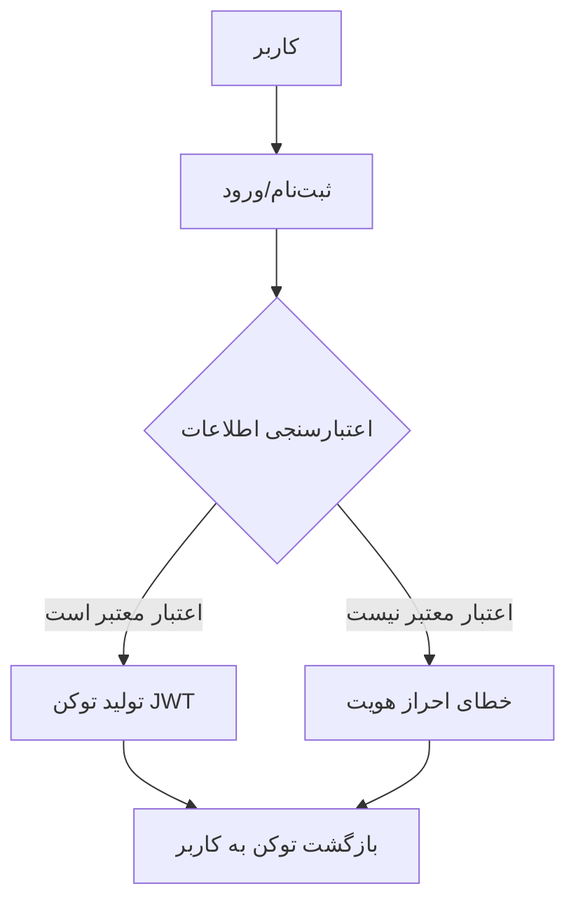
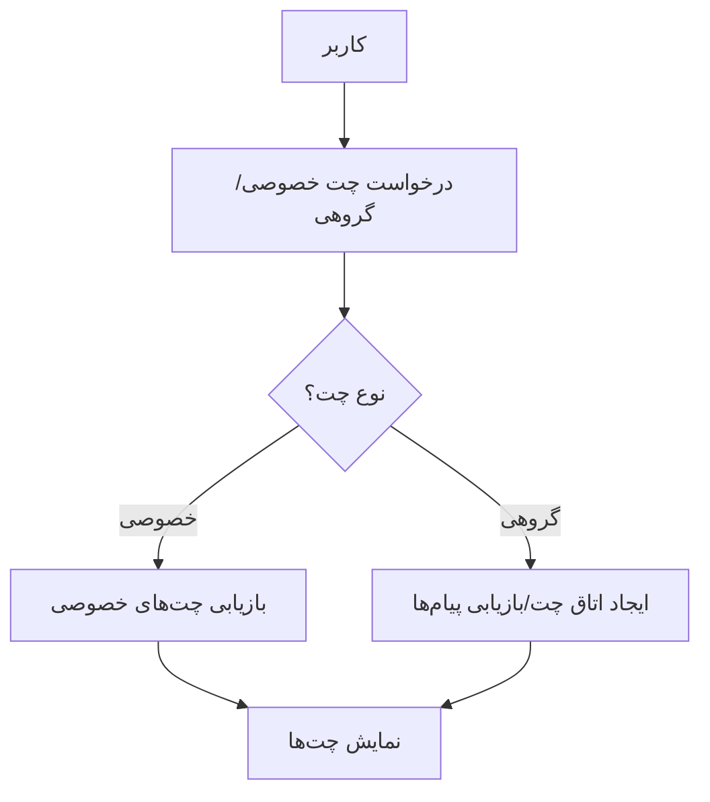

این را به زبان های دیگر
بخوانید: <a href="https://github.com/Pooria82/Chat-Service/blob/main/Documents/English/a)%20Pre-Service%20Implementation.md">
English</a>
### داکیومنت قبل از ایجاد سرویس

#### مقدمه

این داکیومنت به منظور توضیح جزئیات فنی و نحوه پیاده‌سازی یک سرویس چت نوشته شده است. این سرویس شامل امکاناتی نظیر احراز
هویت کاربران، مدیریت چت‌های خصوصی و گروهی، آپلود فایل‌های رسانه‌ای، و پیام‌رسانی در زمان واقعی می‌باشد. در این داکیومنت،
به بررسی نحوه پیاده‌سازی هر یک از این ویژگی‌ها، استفاده از کتابخانه‌های مورد نیاز، و ساختار کدها پرداخته می‌شود.

---

### ۱. احراز هویت کاربران

**کتابخانه‌های استفاده شده:**

- **FastAPI**: برای پیاده‌سازی وب‌سرویس
- **OAuth2**: برای مدیریت احراز هویت و صدور توکن‌های دسترسی
- **PyJWT**: برای تولید و اعتبارسنجی توکن‌های JWT

#### شرح پیاده‌سازی

احراز هویت کاربران با استفاده از OAuth2 و JWT پیاده‌سازی شده است. برای این منظور، یک توکن JWT برای کاربرانی که با موفقیت
وارد سیستم شده‌اند، تولید می‌شود.

1. **ثبت‌نام (Signup):**
    - درخواست ثبت‌نام از کاربر دریافت می‌شود و اطلاعات کاربر در دیتابیس ذخیره می‌شود.
    - قبل از ذخیره‌سازی، رمز عبور کاربر با استفاده از الگوریتم bcrypt هش می‌شود.

2. **ورود (Login):**
    - کاربر با ایمیل و رمز عبور وارد می‌شود.
    - ایمیل و رمز عبور در دیتابیس اعتبارسنجی می‌شوند.
    - در صورت موفقیت، توکن JWT تولید و به کاربر بازگردانده می‌شود.

3. **تولید توکن JWT:**
    - توکن JWT شامل اطلاعات کاربر (مانند ایمیل) و زمان انقضای آن است.
    - توکن با استفاده از کلید خصوصی سرور امضا می‌شود و در پاسخ به کاربر بازگردانده می‌شود.

**فلوچارت احراز هویت:**

---

### ۲. مدیریت چت‌های خصوصی و گروهی

**کتابخانه‌های استفاده شده:**

- **Motor**: برای دسترسی به دیتابیس MongoDB به صورت غیرهمزمان (Async)

#### شرح پیاده‌سازی

سیستم چت به دو نوع اصلی تقسیم شده است: چت‌های خصوصی و چت‌های گروهی (اتاق‌های چت).

1. **چت‌های خصوصی:**
    - لیست چت‌های خصوصی کاربر با استفاده از ایمیل کاربر فعلی از دیتابیس بازیابی می‌شود.
    - وضعیت آنلاین کاربران با استفاده از یک سرویس جداگانه مدیریت می‌شود.

2. **اتاق‌های چت:**
    - کاربران می‌توانند اتاق‌های چت ایجاد کنند و دیگران را به آن اضافه کنند.
    - پیام‌های ارسال شده در هر اتاق چت در دیتابیس ذخیره می‌شوند.

**فلوچارت چت‌های خصوصی و گروهی:**

---

### ۳. آپلود فایل‌های رسانه‌ای

**کتابخانه‌های استفاده شده:**

- **FastAPI UploadFile**: برای مدیریت آپلود فایل‌ها

#### شرح پیاده‌سازی

کاربران می‌توانند فایل‌های رسانه‌ای را برای اشتراک در چت‌ها آپلود کنند. فایل‌های آپلود شده در سرور ذخیره می‌شوند و لینک
آن‌ها در دیتابیس ثبت می‌شود.

**مراحل:**

1. **آپلود فایل:**
    - فایل از کاربر دریافت و در سرور ذخیره می‌شود.
    - لینک فایل در دیتابیس ثبت می‌شود.

2. **ارسال لینک فایل:**
    - لینک فایل به عنوان پیام در چت ارسال می‌شود.

---

### ۴. پیام‌رسانی در زمان واقعی

**کتابخانه‌های استفاده شده:**

- **Socket.IO**: برای مدیریت ارتباطات WebSocket

#### شرح پیاده‌سازی

پیام‌رسانی در زمان واقعی با استفاده از Socket.IO پیاده‌سازی شده است. کاربران با استفاده از توکن JWT احراز هویت می‌شوند و
سپس به یک اتاق چت متصل می‌شوند.

**مراحل:**

1. **اتصال به Socket.IO:**
    - کاربر با استفاده از توکن JWT به سرور Socket.IO متصل می‌شود.
2. **ارسال و دریافت پیام:**
    - پیام‌ها به اتاق‌های چت ارسال و از آن‌ها دریافت می‌شوند.
3. **مدیریت وضعیت آنلاین:**
    - وضعیت آنلاین کاربران با استفاده از WebSocket به‌روزرسانی می‌شود.

---

### نتیجه‌گیری

این داکیومنت به تشریح جزئیات پیاده‌سازی سرویس چت پرداخته و توضیح می‌دهد که چگونه هر یک از ویژگی‌های کلیدی سرویس با
استفاده از کتابخانه‌ها و ابزارهای مناسب پیاده‌سازی شده است. این اطلاعات به توسعه‌دهندگان کمک می‌کند تا با ساختار کلی
پروژه و نحوه عملکرد آن آشنا شوند و در صورت نیاز، تغییرات لازم را اعمال کنند.